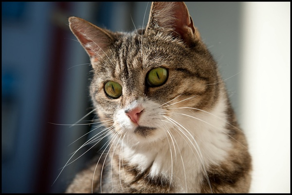

## This document contains brief descriptions of animals.

### Cat
A cat is a small mammal that likes to be scratched and petted,
likes to sleep in the sun, and likes to play. Below is an image
of a cat.

To learn more [follow this link.](https://en.wikipedia.org/wiki/Cat)

### Dog
A dog is a mammal that loves to play and can be a man's best friend.

To learn more [follow this link.](https://en.wikipedia.org/wiki/Dog)

### Elephant

### Horse

### Snake

### Rabbit

### Catfish
